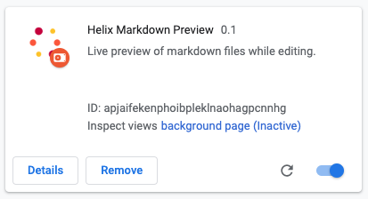

# Helix Sidekick Browser Extension

## Status
[](https://codecov.io/gh/rofe/helix-sidekick)
[](https://circleci.com/gh/rofe/helix-sidekick)
[](https://github.com/rofe/helix-sidekick/blob/master/LICENSE.txt)
[](https://github.com/rofe/helix-sidekick/issues)
[](https://lgtm.com/projects/g/rofe/helix-sidekick)
[](https://github.com/semantic-release/semantic-release)

The Helix Sidekick Browser Extension is a more powerful alternative to the existing [Helix Sidekick Bookmarklet](https://www.hlx.page/tools/sidekick/). The Helix Sidekick is a toolbar for authors working on [Helix projects](https://www.hlx.page/), providing them with context-aware actions like Preview, Edit or Publish. 

## Bookmarklet vs. Browser Extension
The bookmarklet configures Helix Sidekick for a single Helix project, and it needs to be reopened in every new browser window.

Use the browser extension to:
- keep the Helix Sidekick open (or closed) while navigating multiple browser windows
- configure Helix Sidekick for multiple projects without cluttering your browser's bookmark bar

## Installation
- Google Chrome: TBD
- Mozilla Firefox: TBD
- ...

## Development

### Install in Developer mode
1. Clone this repository to your local disk: `git clone https://github.com/rofe/helix-sidekick.git`
2. Open Chrome and navigate to `chrome://extensions`
3. Turn on _Developer mode_ at the top right of the header bar<br />

4. Click the _Load unpacked_ button in the action bar<br />

5. Navigate to the `src` directory of your local copy and click _Select_ to install and activate the extension
6. Verify if your _Extensions_ page displays a box like this:<br />
<br />
   and the tool bar shows a grayed out Helix icon:<br />


### Build

```bash
$ npm install
```

### Test

```bash
$ npm test
```

### Lint

```bash
$ npm run lint
```
